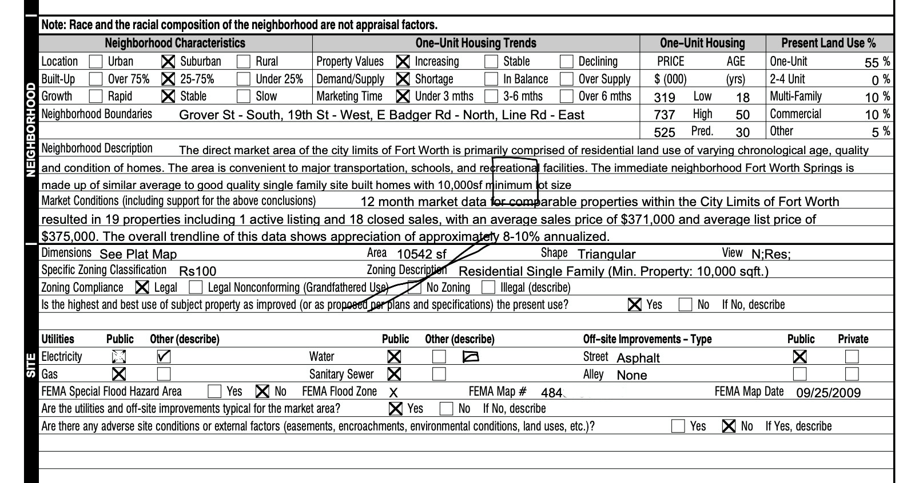

    <h1>Checkbox Detection ☑️</h1>
    Example process to read checkboxes in an image.

---
# Objective:

Implement a solution that accomplishes the following for the attached file.

1. Detects the location of all checkboxes.
    
2. Identifies whether or not the checkbox is filled.
    

## Example document:

# Solution

I tackled the task using two distinct methods, each contained within its own folder.  
I suggest beginning with the first, as the second is designed to build upon the opportunities identified in the first.

1) [First approach: computer vision](/computer_vision/README.md)
2) [Second approach: detection model](/detection_model/README.md)
