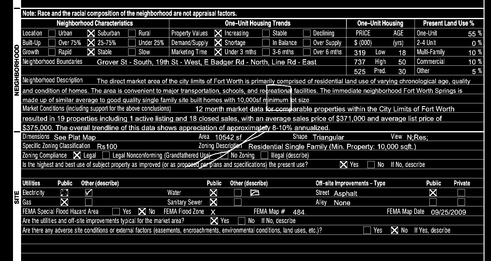
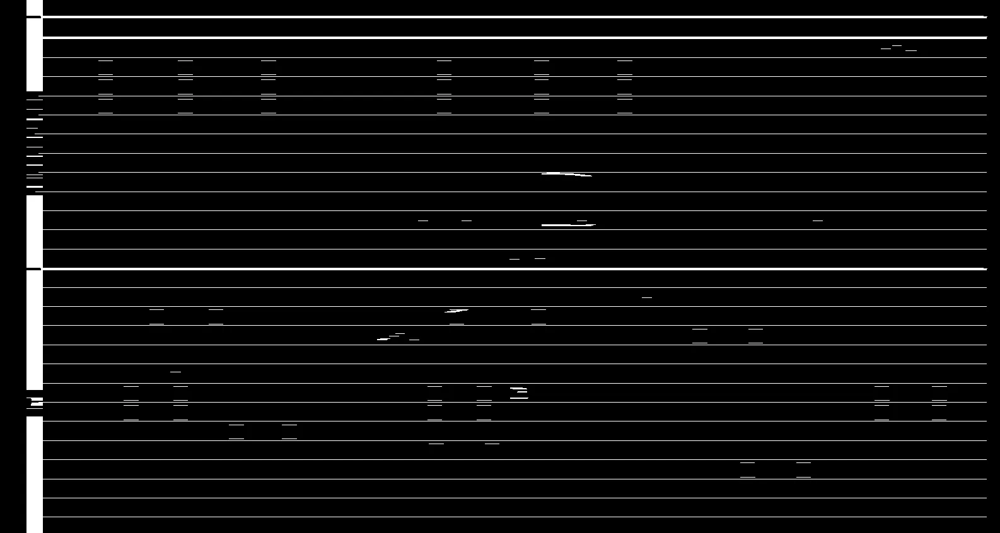
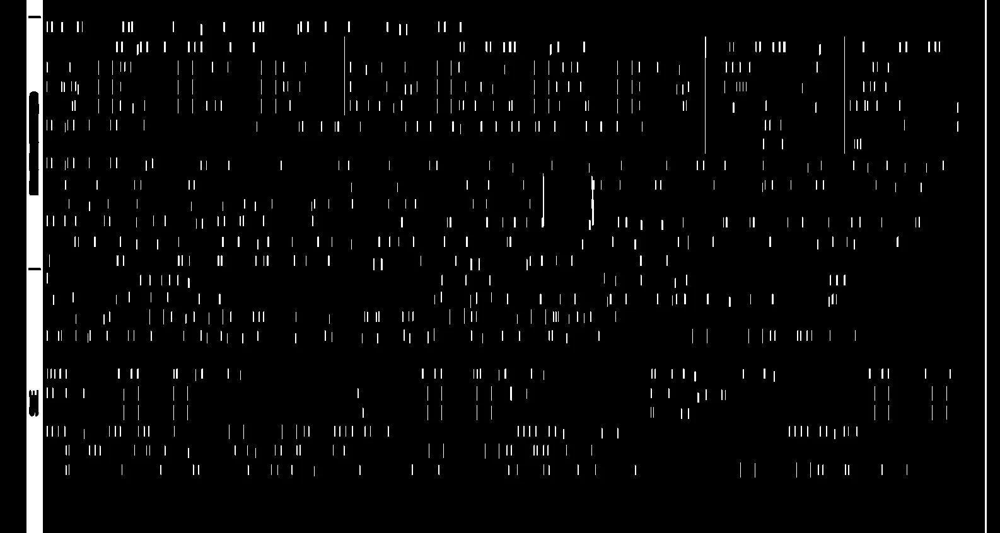
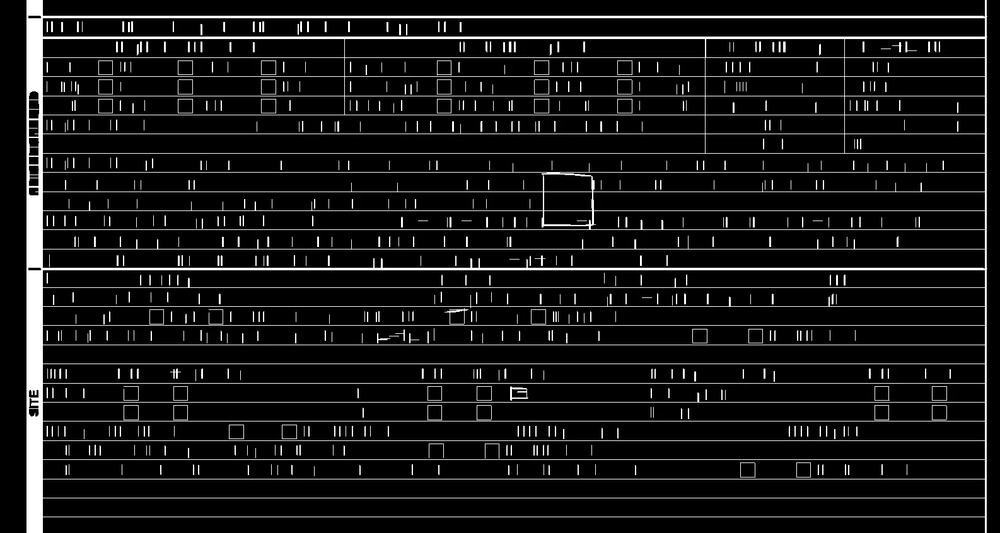
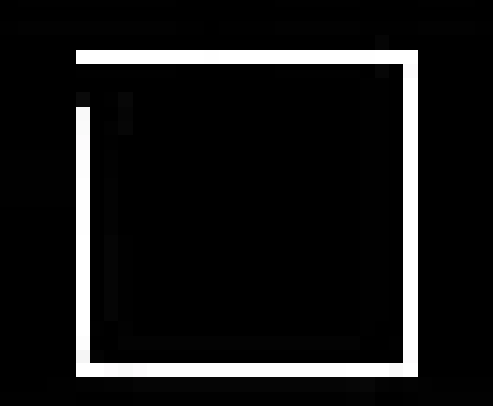
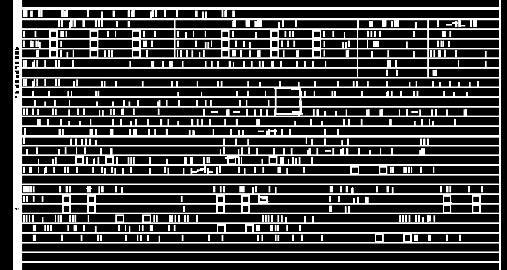
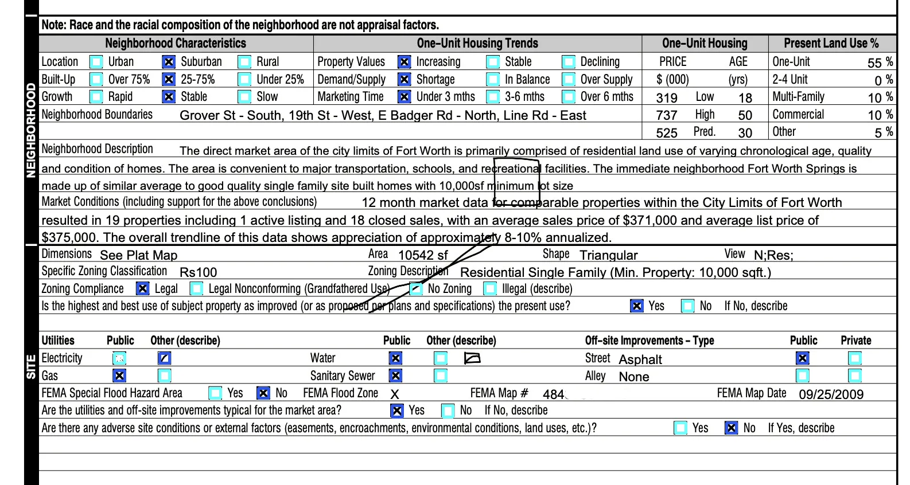

# First approach: Computer Vision

In the following document, I will outline the step-by-step process of how I implemented the initial approach to solve the exercise, focusing on achieving the highest low-level control possible.

For this, I will use Python in conjunction with [OpenCV](https://opencv.org/). Although the latter is written in C++, the Python binding is one of the most tested and will allow me to quickly prototype the solution and assess whether the tool meets the results I am seeking.

Additionally, I have included the [Gradio](https://www.gradio.app/) library to take advantage of the simplicity of its web interface, allowing for an intuitive testing of the implementation's result.

## Step 0: Creating a binary image

To make the process of identifying these elements less complex and clearer, we will first transform the image into a binary form (black and white) and invert it (flip the black and white values).

```python
def convert_to_binary(img):
    gray_scale = cv2.cvtColor(img, cv2.COLOR_BGR2GRAY)
    _, img_bin = cv2.threshold(gray_scale, 127, 255, cv2.THRESH_BINARY)
    return ~img_bin
```



## Step 1: Detecting boxes

The first step would be to identify all the geometric elements that form a square within the document.

This can be achieved in two sub-stages: first, by separately identifying the horizontal and vertical lines, and then working with their intersection.

For both cases, and given our familiarity with the document we are working with, I will set a threshold to ensure that these lines are no shorter than **15 pixels**.

```python
def get_merged_lines(img_bin):
    line_min_width = 15

    horizontal_kernel = np.ones((1, line_min_width), np.uint8)
    vertical_kernel = np.ones((line_min_width, 1), np.uint8)

    horizontal_lines = cv2.morphologyEx(img_bin, cv2.MORPH_OPEN, horizontal_kernel)
    vertical_lines = cv2.morphologyEx(img_bin, cv2.MORPH_OPEN, vertical_kernel)

    return horizontal_lines | vertical_lines
```

<table>
<tr>
<th> Horizontals </th>
<th> Verticals </th>
</tr>
<tr>
<td>



</td>
<td>



</td>
</tr>
</table>

**Merged result:**




## Step 2: Fixing gaps

At this point, we can already start to identify most of the squares that interest us, but there is a problem: there are cases where, due to various factors, the shape is incomplete.

Like the following example:



To address these cases, we can edit the image once again by adding thickness to our lines.

```python
def dilate_lines(lines, shape):
    kernel = np.ones(shape, np.uint8)
    return cv2.dilate(lines, kernel, iterations=1)
```

**Resulting image:**



## Step 3: Identifying checkboxes

Now, we are ready to begin iterating over our squares and filtering those that meet the dimensions of a checkbox in the document. After a few tests, I determined that they are within an area ranging from **200 to 500 pixels**.

```python
stats = cv2.connectedComponentsWithStats(~merged_lines, connectivity=4, ltype=cv2.CV_32S)[2]

# Ignored background and small noise components (dropped 0 and 1 in stats)
for x, y, w, h, area in stats[2:]:
    if 200 < area <= 500:
        # After filtering based on dimensions, from this point onward, we now have the coordinates of our checkbox.
```

## Step 4: Determining the state of each checkbox

So, _what does it mean to be checked?_

With the coordinates of our checkbox, we can now refer to the binary image of the document and evaluate the pixel values within this region of interest (ROI).
Where the value of each pixel will be either white (filled) or black (empty).

Thus, within our ROI, we can calculate the ratio of filled pixels, and with this value, determine whether it is marked ("checked") or not ("unchecked") based on a threshold.

```python
# Crop the region of interest from the binary image
roi = img_bin[y:y + h, x:x + w]

# Count the number of non-zero (white) pixels inside the ROI (filled)
filled_pixels = cv2.countNonZero(roi)

# Calculate the ratio of filled pixels to the total pixels
filled_ratio = filled_pixels / (w * h)
```

For this document, after conducting a few tests, I concluded that in order to consider a checkbox as "checked," its fill ratio must exceed **0.2**.

## Step 5: Bringing everything together

Assigning a color to each state and presenting the final result.

```python
image = cv2.imread(image_path)
img_bin = convert_to_binary(image)
merged_lines = get_merged_lines(img_bin)
merged_lines = dilate_lines(merged_lines, (5, 5))

stats = cv2.connectedComponentsWithStats(~merged_lines, connectivity=4, ltype=cv2.CV_32S)[2]

for x, y, w, h, area in stats[2:]:
    if 200 < area <= 500:
        roi = img_bin[y:y + h, x:x + w]
        filled_pixels = cv2.countNonZero(roi)
        filled_ratio = filled_pixels / (w * h)
        color = (47, 86, 233) if filled_ratio > 0.2 else (110, 255, 255)
        image = cv2.rectangle(image, (x, y), (x + w, y + h), color, 3)

return image
```

## Final result:



## Run it yourself

```shell
# Create a virtual environment and activate it.
python3 -m venv .venv
source .venv/bin/activate

# Install requirements
pip install -r requirements.txt

# Run on local URL: http://127.0.0.1:7860
python app.py
```

# Conclusion

Up to this point, we have reviewed the reasoning and tasks that have led us to this final result for the first approach, considering everything at a low level. However, there are several opportunities for improvement:

- The strategies we employed to identify the checkboxes are heavily dependent on the characteristics of the document used as the foundation, resulting in this model having limited adaptability to other documents.

- The constant manipulation of images can prove to be highly resource-intensive under high traffic volumes, making this implementation poorly scalable for production environments.

For this reason, I developed a second approach to this same problem, training a detection model. I invite you to review it [here](../detection_model/README.md).