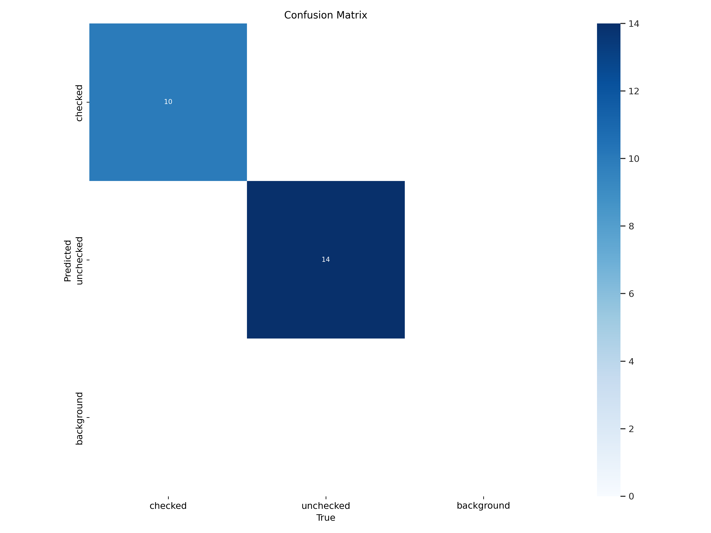
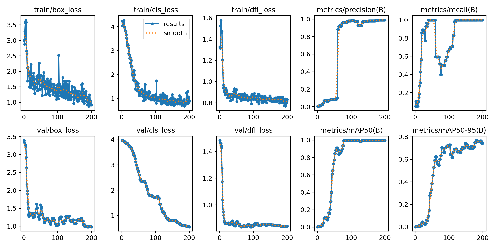
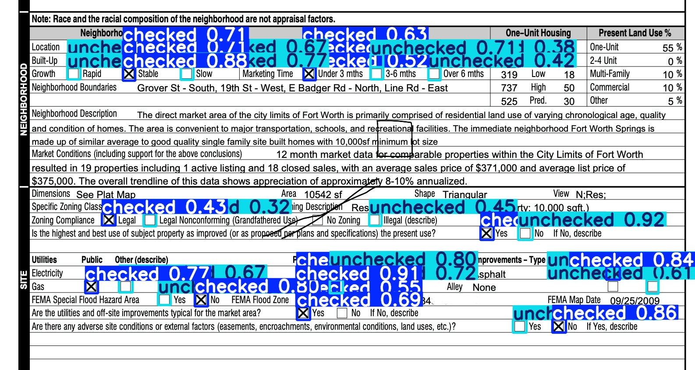
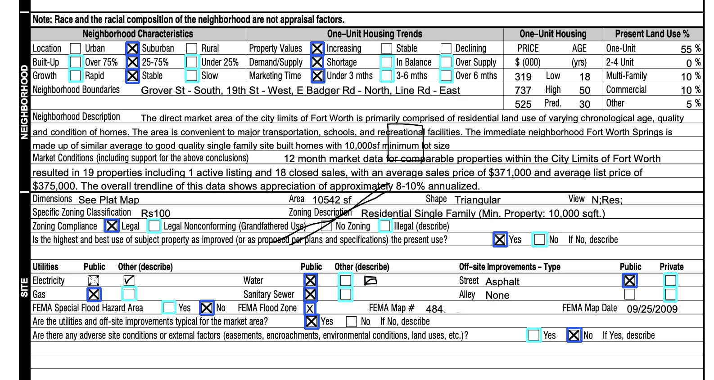

# Second approach: Detection Model

For this second approach, I will opt to use a supervised deep learning model, specifically: [You Only Look Once (YOLO)](https://arxiv.org/abs/1506.02640) based on its popularity and renowned for its speed and accuracy. So I have divided this approach into two distinct stages:


- The creation of the detection model
- The implementation of that created model 

## Creating the model

### Step 0: Building the dataset 

Arguably, the most time-consuming aspect—creating a robust model necessitates a high-quality dataset. For this project, I will be sourcing residential appraisal reports and various other documents to enhance the model, and will personally annotate these images.

However, with the aim of focusing more on the core concept, I will be directing my efforts primarily toward the subsequent steps. Therefore, for this step, I created an account on [Roboflow](https://roboflow.com/) and built the dataset there. Using the platform's tool, I uploaded and annotated each image, they should be available for review and free download [here](https://app.roboflow.com/darioaf/checkbox-detector-il0vm/1) in the YOLOv11 format, which is the one we will be using.

### Step 1: Creating the environment

We will be using the dataset from the previous step in conjunction with [YOLO11](https://yolo11.com/)

In the requirements file I included, there is [ultralytics](https://www.ultralytics.com/), which is essential for YOLO. However, be cautious, as one of its dependencies is [PyTorch](https://pytorch.org/), and since its installation depends on your hardware, I recommend installing it separately.

### Step 2: Training our model

Hooray! From this point onward, we can begin training our model using the following command:

```shell
yolo detect train data=datasets/RARD/data.yaml model=yolo11n.pt epochs=200 patience=75 imgsz=640 mixup=0.3 copy_paste=0.3
```

These are the attributes I used:

- **data:** This `data.yaml` file contains the configuration we need to interpret our dataset. It contains the paths to where the images are stored, along with their corresponding annotations.

- **model:** This specifies the pre-trained model file, I'll be using `yolo11n.pt` because it has the lowest inference times on both CPU and GPU.

- **epochs:** An epoch is one complete pass through the entire training dataset, meaning it will iterate over the dataset n times. After experimenting, 200 gave me a good result.

- **patience:** Means that the training will stop if there is no improvement in the model's performance (validation loss) for n consecutive epochs. For 200 epoch 75 seemed a good number to me.

- **imgsz:** This sets the size of the images that will be fed into the model during training, I choose 640 as it's supported for yolo11n.

- **mixup:** This applies data augmentation by mixing two or more images together, given that we have a limited number of images in the dataset, I found this parameter to be particularly useful in our case.

- **copy_paste:** This is another data augmentation technique that I found useful to our case, where objects from one image are copied and pasted into another image in the dataset.

This command will train the model with our dataset and create a `runs` folder containing our trained model in `runs/detect/train/weights/` alongside relevant information, which we will analyze in the next step.

### Step 3: Evaluate the trained model

Within the `runs/detect/train/` folder, we will have, alongside the model, several metrics to better understand it. On this occasion, I will focus on two:

<table>
<tr>
<th> confusion_matrix </th>
<th></th>
</tr>
<tr>
<td>



</td>
<td>

This chart will aid in understanding the number of false positives and false negatives that occurred during the model evaluation post-training, as well as highlighting where the model misclassifies—detecting an object but failing to assign the correct class.

In our case, it can be observed that the model did not present any instances of misclassifying classes or failing to detect them.

</td>
</tr>
</table>

<table>
<tr>
<th> results </th>
<th></th>
</tr>
<tr>
<td>



</td>
<td>

During training, the model is continuously evaluated, and multiple metrics are employed in the process to assess its performance. In this graphic, we observe the values of all these metrics after each epoch.

This is particularly useful for determining whether the number of epochs we are using is appropriate. For instance, during my tests, I noticed that with fewer epochs, the `train/box_loss` value was higher than the `val/box_loss`, which indicated that I could increase the number of epochs without overfitting the model.

</td>
</tr>
</table>


### Step 4: Test it out

Once the numbers in the evaluation step make sense to us, it is time to examine the model's prediction results for our specific use case.

> Remember that throughout this entire model-building process, the provided document was not used.

```shell
yolo detect predict source=../guideline/sample-section-mod.jpg model=runs/detect/train/weights/best.pt
```



As we can see, the generated model yielded very satisfactory results, especially considering the limited size of our dataset.

## Implementation

Now that we have our trained model, we can implement it as we wish in our project. For illustrative purposes, I will present a simple interface in Python, as we did in the first approach.

### Step 0: Loading the model

```python
DETECTION_MODEL = YOLO("runs/detect/train/weights/best.pt")
```

### Step 1: Performing prediction

```python
results = DETECTION_MODEL.predict(source=image)
```

### Step 2: Doing something with the results

```python
# Since is a single image we only have one element
boxes = results[0].boxes

for box in boxes:
    # By data.yaml in dataset: ['checked', 'unchecked']
    color = (47, 86, 233) if box.cls == 0 else (110, 255, 255)
    
    start_box = (int(box.xyxy[0][0]), int(box.xyxy[0][1]))
    end_box = (int(box.xyxy[0][2]), int(box.xyxy[0][3]))

    # Draw bounding box of object
    image = cv2.rectangle(img=image,
                            pt1=start_box,
                            pt2=end_box,
                            color=color,
                            thickness=3)
```

## Final result:



## Run it yourself

Have in mind that one of the dependencies is [PyTorch](https://pytorch.org/), and since its installation depends on your hardware, I recommend installing it separately; I used the stable 2.5.1 version, along with NVIDIA's [CUDA](https://blogs.nvidia.com/blog/what-is-cuda-2/) 12.4

```shell
# Create a virtual environment and activate it.
python3 -m venv .venv
source .venv/bin/activate

# Install requirements
pip install -r requirements.txt

# Run on local URL: http://127.0.0.1:7860
python app.py
```

# Conclusion

As we can observe, the final result is not perfect, but considering the small dataset and limited resources used, this is an approach with considerable potential.

The advantages of this approach over the first lie in the separation of responsibilities between training and prediction, making it a far more scalable solution in production environments.

Moreover, it is worth noting that in this scenario, the example document was not utilized during the training phase, further illustrating the model's adaptability to various types of documents.